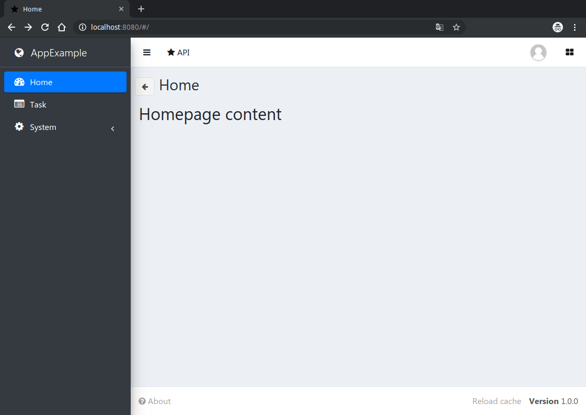
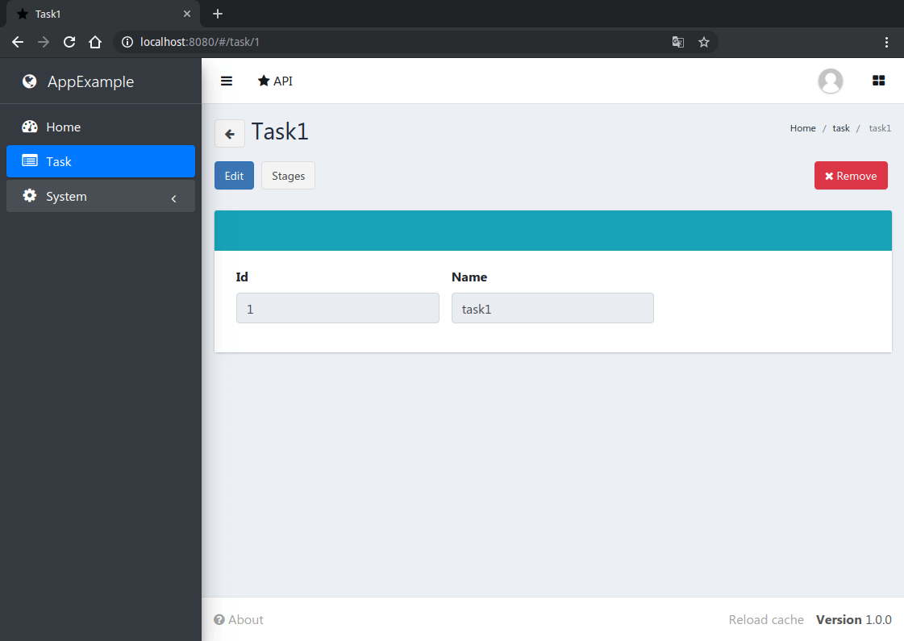
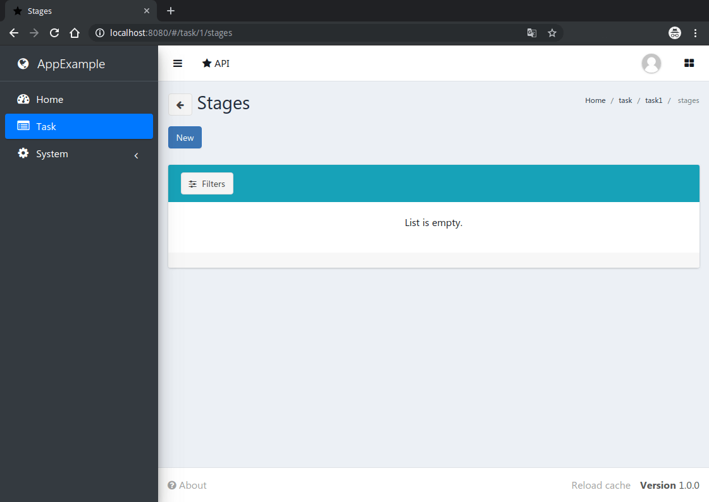
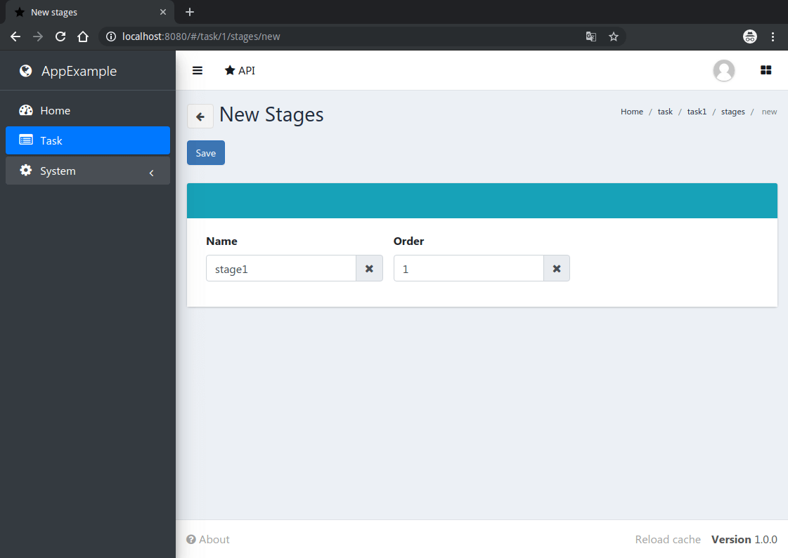

Quick Start
===========
Starting of new project, based on VST Utils Framework, is rather simple.
We recommend to create a virtual environment for each project to avoid conflicts in the system.

Let’s learn by example.
All you need to do is run several commands.
This manual consist of two parts:

1. Description of the process of creating a new application and the main commands for launching and deploying.

2. Description of the process of creating new entities in the application.

New application creation
------------------------

Throughout this tutorial, we’ll go through a creation of a basic poll application.

1. **Install VST Utils**

    .. sourcecode:: bash

        pip install vstutils

    In this case, we install a package with the minimum required set of dependencies for creating new projects.
    However, inside the project, the extra argument `prod` is used, which additionally installs the packages necessary
    for working in the production environment.
    There is also a set of dependencies test, which contains everything you need for testing and analyzing code coverage.

    It is also worth noting extra dependencies as:

    * **rpc** - install dependencies for asynchronous tasks working
    * **ldap** - a set of dependencies for ldap authorization support
    * **doc** - everything which needed to build documentation and to implement the delivery of documentation inside a running server
    * **pil** - library for correct work of image validators
    * **boto3** - an additional set of packages for working with S3 storage outside of AWS
    * **sqs** - a set of dependencies for connecting asynchronous tasks to SQS queues (can be used instead of the **rpc**).

    You can combine multiple dependencies at the same time to assemble your set of functionality into a project.
    For example, to work an application with asynchronous tasks and media storage in MinIO, you will need the following command:

    .. sourcecode:: bash

        pip install vstutils[prod,rpc,boto3]

    To install the most complete set of dependencies, you can use the common parameter **all**.

    .. sourcecode:: bash

        pip install vstutils[all]

2. **Create new project, based on VST Utils**

    If this is your first time using vstutils, you’ll have to take care of some initial setup.
    Namely, you’ll need to auto-generate some code that establishes a vstutils application –
    a collection of settings for an instance of vstutils, including database configuration,
    Django-specific and vstutils-specific options and application-specific settings.
    To create new project execute following command:

    .. sourcecode:: bash

        python -m vstutils newproject --name {{app_name}}

    This command will confirm you such options of new app, as:

    * **project name** - name of your new application;
    * **project guiname** - name of your new application, that will be used in GUI (web-interface);
    * **project directory** - path to directory, where project will be created.

    Or you can execute following command, that includes all needed data for new project creation.

    .. sourcecode:: bash

        python -m vstutils newproject --name {{app_name}} --dir {{app_dir}} --guiname {{app_guiname}} --noinput

    This command creates new project without confirming any data.

    These commands create several files in ``project directory``.
    .. sourcecode::

       /{{app_dir}}/{{app_name}}
        ├── .coveragerc
        ├── frontend_src
        │   ├── app
        │   │   └── index
        │   ├── .editorconfig
        │   ├── .eslintrc.js
        │   └── .prettierrc
        ├── MANIFEST.in
        ├── package.json
        ├── .pep8
        ├── README.rst
        ├── requirements-test.txt
        ├── requirements.txt
        ├── setup.cfg
        ├── setup.py
        ├── {{app_name}}
        │   ├── __init__.py
        │   ├── __main__.py
        │   ├── models
        │   │   └── __init__.py
        │   ├── settings.ini
        │   ├── settings.py
        │   ├── web.ini
        │   └── wsgi.py
        ├── test.py
        ├── tox.ini
        └── webpack.config.jsdefault

    where:

    * **frontend_src** - directory that contains all sources for frontend;
    * **MANIFEST.in** - this file is used for building installation package;
    * **{{app_name}}** - directory with files of your application;
    * **package.json** - this file contains list of frontend dependencies and commands to build;
    * **README.rst** - default README file for your application (this file includes base commands for starting/stopping your application);
    * **requirements-test.txt** - file with list of requirements for test environment;
    * **requirements.txt** - file with list of requirements for your application;
    * **setup.cfg** - this file is used for building installation package;
    * **setup.py** - this file is used for building installation package;
    * **test.py** - this file is used for tests creation;
    * **tox.ini** - this file is used for tests execution;
    * **webpack.config.js.default** - this file contain minimal script for webpack (replace '.default' if write smthg in 'app.js').

    You should execute below commands  from the ``/{{app_dir}}/{{app_name}}/`` directory.
    It is good practice to use tox (should be installed before use) to create a debugging environment for your application.
    For these purposes, it is recommended to use ``tox -e contrib`` in the project directory,
    which will automatically create a new environment with the required dependencies.

3. **Apply migrations**

    Let’s verify a newly created vstutils project does work.
    Change into the outer ``/{{app_dir}}/{{app_name}}`` directory, if you haven’t already,
    and run the following command:

    .. sourcecode:: bash

        python -m {{app_name}} migrate

    This command create SQLite (by default) database with default SQL-schema.
    VSTUTILS supports all databases `Django does <https://docs.djangoproject.com/en/3.2/ref/databases/#databases>`_.

4. **Create superuser**

    .. sourcecode:: bash

        python -m {{app_name}} createsuperuser

5. **Start your application**

    .. sourcecode:: bash

        python -m {{app_name}} web

    Web-interface of your application has been started on the port 8080.
    You’ve started the vstutils production server based on `uWSGI <https://uwsgi-docs.readthedocs.io/>`_.

    .. warning::
        Now’s a good time to note: if you want to run the web-server with a debugger, then you should run
        `the standard Django's dev-server <https://docs.djangoproject.com/en/3.2/intro/tutorial01/#the-development-server>`_.

    .. image:: img/app_example_login_page.png

    If you need to stop the server, use following command:

    .. sourcecode:: bash

        python -m {{app_name}} web stop=/tmp/{{app_name}}_web.pid

You've created the simplest application, based on VST Utils framework.
This application only contains User Model. If you want to create your own models look at the section below.

Adding new models to application
--------------------------------
If you want to add some new entities to your application, you need to do following on the back-end:

 1. Create Model;
 2. Create Serializer (optional);
 3. Create View (optional);
 4. Add created Model or View to the API;
 5. Make migrations;
 6. Apply migrations;
 7. Restart your application.

Let's look how you can do it on the AppExample - application, that has 2 custom models:

* Task (abstraction for some tasks/activities, that user should do);
* Stage (abstraction for some stages, that user should do to complete the task. This model is nested into the Task Model).

Models creation
~~~~~~~~~~~~~~~
Firstly, you need to create file ``{{model_name}}.py`` in the ``/{{app_dir}}/{{app_name}}/{{app_name}}/models`` directory.

Let make out an example from **`BModel**:

.. autoclass:: vstutils.models.BModel
    :exclude-members:
    :noindex:

More information about Models you can find in `Django Models documentation <https://docs.djangoproject.com/en/3.2/topics/db/models/>`_.

If you don't need to create custom :ref:`serializers<SerializerCreateTag>` or :ref:`view sets<ViewSetCreateTag>`, you can go to this :ref:`stage<AddModelsToApiTag>`.

.. _SerializerCreateTag:

Serializers creation
~~~~~~~~~~~~~~~~~~~~

*Note - If you don't need custom serializer you can skip this section*

Firstly, you need to create file ``serializers.py`` in the ``/{{app_dir}}/{{app_name}}/{{app_name}}/`` directory.

Then you need to add some code like this to ``serializers.py``:

.. sourcecode:: python

    from datetime import datetime
    from vstutils.api import serializers as vst_serializers
    from . import models as models

    class StageSerializer(models.Stage.generated_view.serializer_class):

        class Meta:
            model = models.Stage
            fields = ('id',
                    'name',
                    'order',)

        def update(self, instance, validated_data):
            # Put custom logic to serializer update
            instance.last_update = datetime.utcnow()
            super().update(instance, validated_data)

More information about Serializers you can find in `Django REST Framework documentation for Serializers <https://www.django-rest-framework.org/api-guide/serializers/#modelserializer>`_.

.. _ViewSetCreateTag:

Views creation
~~~~~~~~~~~~~~

*Note - If you don't need custom view set you can skip this section*

Firstly, you need to create file ``views.py`` in the ``/{{app_dir}}/{{app_name}}/{{app_name}}/`` directory.

Then you need to add some code like this to ``views.py``:

.. sourcecode:: python

    from vstutils.api import decorators as deco
    from vstutils.api.base import ModelViewSet
    from . import serializers as sers
    from .models import Stage, Task

    class StageViewSet(Stage.generated_view):
        serializer_class_one = sers.StageSerializer

    '''
    Decorator, that allows to put one view into another
        * 'tasks' - suburl for nested view
        * 'methods=["get"]' - allowed methods for this view
        * 'manager_name='hosts' - Name of related QuerySet to the child model instances (we set it in HostGroup model as "hosts = models.ManyToManyField(Host)")
        *  'view=Task.generated_view' - Nested view, that will be child view for decorated view
    '''
    @nested_view('stage', view=StageViewSet)
    class TaskViewSet(Task.generated_view):
        '''
        Task operations.
        '''

More information about Views and ViewSets you can find in `Django REST Framework documentation for views <https://www.django-rest-framework.org/api-guide/viewsets/>`_.

.. _AddModelsToApiTag:

Adding Models to API
~~~~~~~~~~~~~~~~~~~~

To add created Models to the API you need to write something like this at the end of your ``settings.py`` file:

.. sourcecode:: python

    '''
    Some code generated by VST Utils
    '''

    '''
    Add Task view set to the API
    Only 'root' (parent) views should be added there.
    Nested views added automatically, that's why there is only Task view.
    Stage view is added altogether with Task as nested view.
    '''
    API[VST_API_VERSION][r'task'] = {
        'view': 'newapp2.views.TaskViewSet'
    }

    '''
    You can add model too.
    All model generate base ViewSet with data that they have, if you don't create custom ViewSet or Serializer
    '''
    API[VST_API_VERSION][r'task'] = dict(
        model='newapp2.models.Task'
    )

    # Adds link to the task view to the GUI menu
    PROJECT_GUI_MENU.insert(0, {
        'name': 'Task',
         # CSS class of font-awesome icon
        'span_class': 'fa fa-list-alt',
        'url': '/task'
    })

Migrations creation
~~~~~~~~~~~~~~~~~~~
To make migrations open ``/{{app_dir}}/{{app_name}}/`` directory and execute following command:

.. sourcecode:: bash

    python -m {{app_name}} makemigrations {{app_name}}

More information about Migrations you can find in `Django Migrations documentation <https://docs.djangoproject.com/en/3.2/topics/migrations/>`_.

Migrations applying
~~~~~~~~~~~~~~~~~~~
To apply migrations you need to open ``/{{app_dir}}/{{app_name}}/`` directory and execute following command:

.. sourcecode:: bash

    python -m {{app_name}} migrate

Restart of Application
~~~~~~~~~~~~~~~~~~~~~~
To restart your application, firstly, you need to stop it (if it was started before):

.. sourcecode:: bash

    python -m {{app_name}} web stop=/tmp/{{app_name}}_web.pid

And then start it again:

.. sourcecode:: bash

    python -m {{app_name}} web

After cache reloading you will see following page:

As you can see, link to new Task View has been added to the sidebar menu. Let's click on it.

There is no task instance in your app. Add it using 'new' button.

After creating a new task you'll see a following page:

As you can see, there is 'stages' button, that opens page with this task's stages list. Let's click on it.

There is no stage instances in your app. Let's create 2 new stages.

After stages creation page with stages list will looks like this:

.. image:: img/app_example_stage_list_page.png

Sorting by 'order' field works, as we mentioned in the our ``models.py`` file for Stage Model.

Additional information about Django and Django REST Framework you can find in
`Django documentation <https://docs.djangoproject.com/en/3.2/>`_ and `Django REST Framework documentation <https://www.django-rest-framework.org/>`_.
